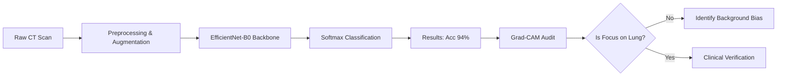

# AI-Driven Lung Cancer Classification with Explainable AI (XAI) Audit

This project implements a Deep Learning pipeline using **EfficientNet-B0** to classify Chest CT scans into three categories: **Malignant, Benign, and Normal**. Beyond achieving a high statistical accuracy of 94%, this project focuses on **Interpretability** by using Grad-CAM to detect "Shortcut Learning" biases that often compromise medical AI.

## 📊 Project Performance

The model was evaluated on a strictly partitioned dataset to ensure clinical relevance.

### Final Classification Report

| Class | Precision | Recall | F1-Score | Support |
| --- | --- | --- | --- | --- |
| **Benign** | 0.91 | 0.94 | 0.93 | 158 |
| **Malignant** | **1.00** | **1.00** | **1.00** | 85 |
| **Normal** | 0.95 | 0.92 | 0.93 | 183 |
| **Accuracy** |  |  | **0.94** | 426 |

---

## 🛠️ Machine Learning Pipeline

The project follows a modular 4-stage workflow designed for medical image reproducibility:

### **Stage 1: Data Engineering & Preprocessing**

* **Patient-Level Split:** Data is split by patient ID (not just random image shuffling) to prevent data leakage.
* **Augmentation Suite:** To improve robustness, training images undergo Random Horizontal Flips and Rotations (±10°).
* **Normalization:** Scaling pixels to a mean/std of 0.5 to stabilize EfficientNet gradients.

### **Stage 2: Validation Strategy**

* **Hold-out Validation:** We employed a **Hold-out** strategy rather than standard K-Fold. This ensures that the model is tested on a static, unseen set of patients, providing a realistic "real-world" test for diagnostic accuracy.

### **Stage 3: Model Architecture**

* **Backbone:** **EfficientNet-B0** (Transfer Learning).
* **Classifier:** A custom head with a **0.2 Dropout layer** and a Linear layer mapped to 3 classes.
* **Optimizer:** Adam () with Cross-Entropy Loss.

### **Stage 4: Explainable AI (XAI) Audit**

* **Grad-CAM Implementation:** Using the final convolutional layer to produce heatmaps of the model's "attention."
* **Clinical Verification:** Comparing AI focus areas against radiologist-marked nodules to ensure the model is learning anatomy, not noise.

---

## 🔍 The "Visual Audit" Finding

Despite the **1.00 F1-Score** for malignant cases, a Grad-CAM analysis revealed a critical finding:

* **Discovery:** The model reached its perfect score for malignant cases by focusing on **peripheral scanner artifacts** (scanner bed curvature) rather than the pulmonary nodules.
* **Engineering Insight:** This identified a **Shortcut Learning** bias. It demonstrates that metrics alone are insufficient for medical AI; without visual auditing, a "perfect" model can be fundamentally flawed.

---

## 📂 Project Structure

* `data/`: `train/` and `valid/` folders (Patient-split).
* `models/`: Stores the saved weights (`efficientnet_b0_final.pth`).
* `final_training_logs/`: CSV logs of accuracy and loss per epoch.
* `src/final_evaluate_results.py`: Script to generate the Confusion Matrix and Curves.

## 🛠️ Usage

1. **Installation:** `pip install torch torchvision pandas matplotlib seaborn scikit-learn opencv-python`
2. **Evaluation:** Run `python src/final_evaluate_results.py` to generate metrics from the saved model and logs.

---

## 💡 Future Clinical Mitigations

1. **Lung Parenchyma Masking:** Implementing U-Net segmentation to isolate lung tissue and force the model to ignore background artifacts.
2. **Structure Suppression:** Adopting commercial-grade techniques (like Bone/Vessel suppression) to clarify the "needle in the haystack" as seen in clinical tools like ClearRead.

---

## Disclaimer

⚠️ This is a research and educational project. The model is **not approved for clinical diagnosis** and should not be used as a substitute for professional medical advice.

***

## Contact

For questions, collaboration, or feedback, please contact the project author.

***

